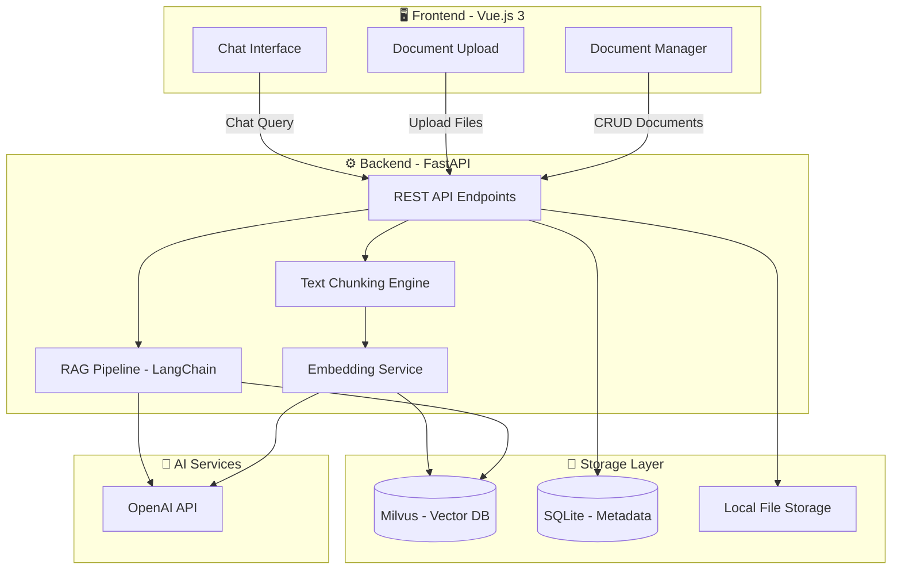
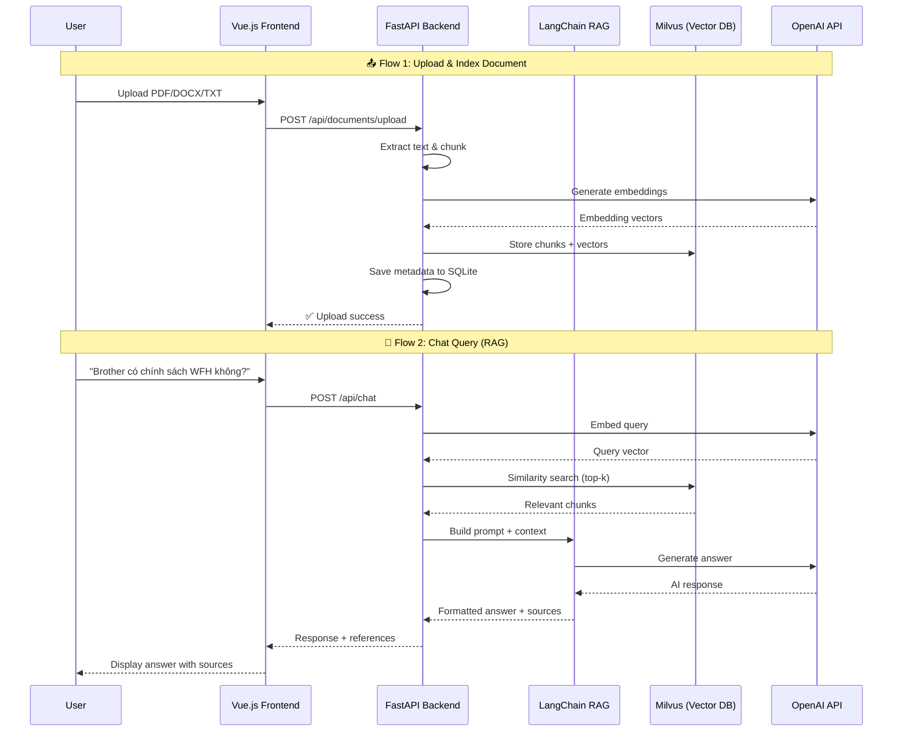
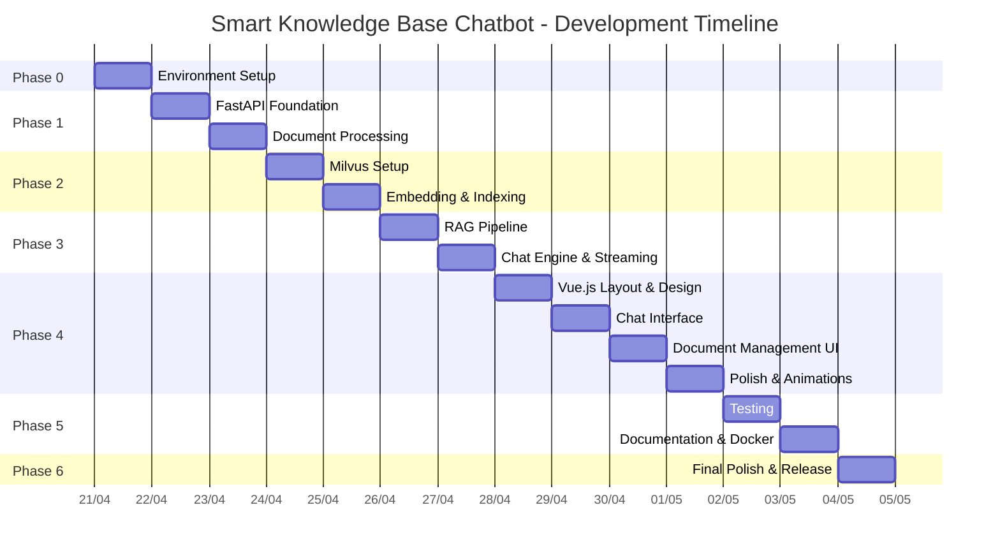

# 🚀 Smart-Knowledge-Base-Chatbot — Implementation Plan

> **Mục tiêu**: Xây dựng một chatbot RAG (Retrieval-Augmented Generation) tra cứu tài liệu nội bộ công ty,
> thể hiện năng lực Python + FastAPI + Vector DB + AI/NLP cho vị trí SDE tại Brother Industries (Vietnam).

---

## 📋 Mục lục

1. [Tổng quan kiến trúc](#1-tổng-quan-kiến-trúc)
2. [Tech Stack chi tiết](#2-tech-stack-chi-tiết)
3. [Cấu trúc thư mục](#3-cấu-trúc-thư-mục)
4. [Các Phase triển khai](#4-các-phase-triển-khai)
5. [Git Commit Strategy (Horenso)](#5-git-commit-strategy-horenso)
6. [Checklist hoàn thiện](#6-checklist-hoàn-thiện)
7. [Timeline ước tính](#7-timeline-ước-tính)

---

## 1. Tổng quan kiến trúc



### Luồng hoạt động chính (Core Flow)



---

## 2. Tech Stack chi tiết

### Backend

| Công nghệ | Phiên bản | Vai trò | Lý do chọn |
|---|---|---|---|
| **Python** | 3.11+ | Ngôn ngữ chính | Yêu cầu JD, hệ sinh thái AI mạnh |
| **FastAPI** | 0.115+ | Web framework | Yêu cầu JD, async, auto docs |
| **LangChain** | 0.3+ | RAG orchestration | Chuẩn industry cho RAG pipeline |
| **OpenAI SDK** | 1.x | AI service | Embedding + Chat completion |
| **PyMilvus** | 2.4+ | Vector DB client | Kết nối Milvus |
| **Unstructured** | 0.x | Document parsing | Parse PDF, DOCX, TXT |
| **SQLAlchemy** | 2.0+ | ORM | Quản lý metadata |
| **SQLite** | Built-in | Relational DB | Nhẹ, không cần setup |
| **Pydantic** | 2.x | Data validation | FastAPI integration |
| **Uvicorn** | 0.30+ | ASGI server | Production-ready |
| **python-multipart** | 0.x | File upload | Hỗ trợ multipart form |

### Frontend

| Công nghệ | Phiên bản | Vai trò | Lý do chọn |
|---|---|---|---|
| **Vue.js** | 3.5+ | UI framework | Yêu cầu JD |
| **Vite** | 6.x | Build tool | Nhanh, modern |
| **Pinia** | 2.x | State management | Official Vue store |
| **Vue Router** | 4.x | Routing | SPA navigation |
| **Axios** | 1.x | HTTP client | API communication |
| **Markdown-it** | 14.x | Markdown render | Hiển thị response AI |
| **highlight.js** | 11.x | Code highlighting | Syntax highlighting trong chat |

### Infrastructure

| Công nghệ | Vai trò | Lý do chọn |
|---|---|---|
| **Docker + Docker Compose** | Containerization | Dễ setup, chuyên nghiệp |
| **Milvus Lite** | Vector Database | Open-source, chạy embedded không cần Docker |
| **Nginx** | Reverse proxy | Production deployment (optional) |

> [!IMPORTANT]
> **Tại sao chọn Milvus thay vì Pinecone?**
> - Milvus là **open-source**, chạy **local** được → không tốn tiền khi demo
> - Có mode **Milvus Lite** chạy embedded trong Python (không cần Docker cho dev)
> - Pinecone là cloud-only, cần credit card → không tiện cho portfolio project
> - Khi phỏng vấn, nói: *"Tôi chọn Milvus vì có thể self-host, phù hợp cho dữ liệu nội bộ công ty cần bảo mật"* → rất ấn tượng

> [!TIP]
> **Về OpenAI API Key**: Bạn cần tạo tài khoản tại [platform.openai.com](https://platform.openai.com) và nạp ~$5 credit. Đủ dùng cho cả quá trình phát triển + demo.
> Nếu muốn **miễn phí hoàn toàn**, có thể thay bằng model local (Ollama + llama3) — mình sẽ hỗ trợ nếu cần.

---

## 3. Cấu trúc thư mục

```
smart-knowledge-base-chatbot/
├── 📁 backend/                     # FastAPI Backend
│   ├── 📁 app/
│   │   ├── __init__.py
│   │   ├── main.py                 # FastAPI app entry point
│   │   ├── config.py               # Settings & environment vars
│   │   ├── 📁 api/
│   │   │   ├── __init__.py
│   │   │   ├── 📁 routes/
│   │   │   │   ├── __init__.py
│   │   │   │   ├── chat.py         # POST /api/chat
│   │   │   │   ├── documents.py    # CRUD /api/documents
│   │   │   │   └── health.py       # GET /api/health
│   │   │   └── 📁 dependencies/
│   │   │       ├── __init__.py
│   │   │       └── services.py     # Dependency injection
│   │   ├── 📁 core/
│   │   │   ├── __init__.py
│   │   │   ├── rag_pipeline.py     # LangChain RAG logic
│   │   │   ├── embeddings.py       # Embedding service
│   │   │   ├── chunking.py         # Text splitting strategies
│   │   │   └── document_loader.py  # Parse PDF/DOCX/TXT
│   │   ├── 📁 models/
│   │   │   ├── __init__.py
│   │   │   ├── schemas.py          # Pydantic request/response
│   │   │   └── database.py         # SQLAlchemy models
│   │   ├── 📁 services/
│   │   │   ├── __init__.py
│   │   │   ├── chat_service.py     # Chat business logic
│   │   │   ├── document_service.py # Document CRUD logic
│   │   │   └── vector_service.py   # Milvus operations
│   │   └── 📁 utils/
│   │       ├── __init__.py
│   │       └── helpers.py          # Utility functions
│   ├── 📁 tests/
│   │   ├── __init__.py
│   │   ├── test_chat.py
│   │   ├── test_documents.py
│   │   └── conftest.py             # Test fixtures
│   ├── 📁 uploads/                 # Uploaded documents storage
│   ├── 📁 data/                    # SQLite DB & Milvus data
│   ├── requirements.txt
│   ├── requirements-dev.txt
│   ├── .env.example
│   └── Dockerfile
│
├── 📁 frontend/                    # Vue.js 3 Frontend
│   ├── 📁 src/
│   │   ├── App.vue
│   │   ├── main.js
│   │   ├── 📁 views/
│   │   │   ├── ChatView.vue        # Main chat page
│   │   │   ├── DocumentsView.vue   # Document management
│   │   │   └── AboutView.vue       # About / System info
│   │   ├── 📁 components/
│   │   │   ├── 📁 chat/
│   │   │   │   ├── ChatWindow.vue      # Chat container
│   │   │   │   ├── MessageBubble.vue   # Single message
│   │   │   │   ├── ChatInput.vue       # Input + send button
│   │   │   │   └── SourceCard.vue      # Reference sources
│   │   │   ├── 📁 documents/
│   │   │   │   ├── UploadZone.vue      # Drag & drop upload
│   │   │   │   ├── DocumentList.vue    # List of documents
│   │   │   │   └── DocumentCard.vue    # Single document card
│   │   │   └── 📁 layout/
│   │   │       ├── AppHeader.vue       # Top navigation
│   │   │       ├── AppSidebar.vue      # Side navigation
│   │   │       └── AppFooter.vue       # Footer
│   │   ├── 📁 composables/
│   │   │   ├── useChat.js          # Chat state & logic
│   │   │   └── useDocuments.js     # Document state & logic
│   │   ├── 📁 services/
│   │   │   └── api.js              # Axios API client
│   │   ├── 📁 stores/
│   │   │   ├── chatStore.js        # Pinia chat store
│   │   │   └── documentStore.js    # Pinia document store
│   │   ├── 📁 router/
│   │   │   └── index.js            # Vue Router config
│   │   └── 📁 assets/
│   │       └── 📁 styles/
│   │           ├── main.css        # Global styles
│   │           ├── variables.css   # CSS custom properties
│   │           └── animations.css  # Animations
│   ├── index.html
│   ├── vite.config.js
│   ├── package.json
│   └── Dockerfile
│
├── 📁 docs/                        # Documentation
│   ├── api-reference.md            # API documentation
│   ├── architecture.md             # Architecture decisions
│   └── 📁 sample-docs/            # Sample company documents for demo
│       ├── company-policy.pdf
│       ├── onboarding-guide.txt
│       └── tech-standards.md
│
├── docker-compose.yml              # Full stack orchestration
├── Makefile                        # Convenience commands
├── README.md                       # 🇻🇳 🇬🇧 🇯🇵 Trilingual
├── .gitignore
├── .env.example
└── LICENSE
```

---

## 4. Các Phase triển khai

---

### 🟢 Phase 0: Environment Setup (Ngày 1)

**Mục tiêu**: Setup môi trường dev, cài đặt tools, tạo project skeleton.

#### Checklist:
- [ ] Cài Python 3.11+ (`python --version`)
- [ ] Cài Node.js 20+ LTS (`node --version`)
- [ ] Cài Docker Desktop (cho Milvus nếu không dùng Lite mode)
- [ ] Tạo OpenAI API key tại [platform.openai.com](https://platform.openai.com)
- [ ] Setup Python virtual environment
- [ ] Setup Vue.js project với Vite
- [ ] Tạo cấu trúc thư mục backend
- [ ] Tạo `.env.example` và `.gitignore`
- [ ] First commit: `feat: initialize project structure`

#### Các bước cụ thể:

```bash
# 1. Backend setup
cd d:\skbc
mkdir backend
cd backend
python -m venv venv
.\venv\Scripts\activate
pip install fastapi uvicorn python-dotenv

# 2. Frontend setup (sẽ chạy lệnh khác)
cd d:\skbc
npm create vue@latest frontend -- --typescript=false --jsx=false --router --pinia --eslint --prettier

# 3. Tạo file .env.example
```

**Output Phase 0**: Project chạy được cả backend (FastAPI hello world) và frontend (Vue default page).

---

### 🟡 Phase 1: Backend Core — FastAPI + Document Processing (Ngày 2-3)

**Mục tiêu**: Xây dựng API endpoints cơ bản, upload & parse documents.

#### Tasks:

##### 1.1 FastAPI App Foundation
- [ ] Tạo `main.py` với CORS middleware, lifespan events
- [ ] Tạo `config.py` đọc .env settings
- [ ] Tạo health check endpoint: `GET /api/health`
- [ ] Setup automatic API docs (Swagger UI tại `/docs`)

##### 1.2 Document Upload & Processing
- [ ] Tạo endpoint `POST /api/documents/upload` (nhận PDF, DOCX, TXT)
- [ ] Implement file validation (type, size limit 10MB)
- [ ] Extract text từ documents (dùng `unstructured` library)
- [ ] Implement text chunking strategy:
  - **Chunk size**: 500 tokens
  - **Overlap**: 50 tokens
  - Sử dụng `RecursiveCharacterTextSplitter` từ LangChain

##### 1.3 SQLite Metadata
- [ ] Thiết kế schema: documents table (id, filename, file_type, chunk_count, upload_date, status)
- [ ] Setup SQLAlchemy + create tables
- [ ] CRUD endpoints:
  - `GET /api/documents` — list all documents
  - `GET /api/documents/{id}` — document detail
  - `DELETE /api/documents/{id}` — delete document + vectors

#### Key Files:
```python
# backend/app/main.py — Entry point
# backend/app/config.py — Settings
# backend/app/api/routes/documents.py — Document endpoints
# backend/app/api/routes/health.py — Health check
# backend/app/core/document_loader.py — Parse files
# backend/app/core/chunking.py — Text splitting
# backend/app/models/database.py — SQLAlchemy models
# backend/app/models/schemas.py — Pydantic schemas
# backend/app/services/document_service.py — Business logic
```

#### Commit Messages:
```
feat: add FastAPI app foundation with CORS and health check
feat: implement document upload endpoint with file validation
feat: add text extraction for PDF, DOCX, TXT formats
feat: implement text chunking with RecursiveCharacterTextSplitter
feat: add SQLite metadata storage with SQLAlchemy
feat: implement document CRUD endpoints
test: add unit tests for document processing
```

**Output Phase 1**: Upload một file PDF → server parse, chunk text, lưu metadata.

---

### 🔴 Phase 2: Vector DB + Embedding (Ngày 4-5)

**Mục tiêu**: Kết nối Milvus, tạo embeddings, lưu vectors.

#### Tasks:

##### 2.1 Milvus Setup
- [ ] Cài `pymilvus` với Milvus Lite mode (embedded, không cần Docker)
- [ ] Tạo collection schema:
  ```
  Collection: "document_chunks"
  Fields:
    - id: VARCHAR (primary key)
    - document_id: VARCHAR
    - content: VARCHAR (chunk text)
    - embedding: FLOAT_VECTOR (dim=1536 cho text-embedding-3-small)
    - metadata: JSON (filename, chunk_index, page_number)
  Index: IVF_FLAT on embedding field
  ```
- [ ] Implement `vector_service.py`:
  - `insert_vectors()` — batch insert
  - `search_similar()` — similarity search với top-k
  - `delete_by_document_id()` — xóa theo document
  - `get_collection_stats()` — thống kê

##### 2.2 Embedding Service
- [ ] Tạo `embeddings.py` wrapper cho OpenAI Embeddings:
  - Model: `text-embedding-3-small` (rẻ, hiệu quả)
  - Dimension: 1536
  - Batch processing cho nhiều chunks
- [ ] Implement retry logic + rate limiting
- [ ] Cache embeddings đã tạo (tránh gọi API lại)

##### 2.3 Pipeline Kết Nối
- [ ] Sau khi upload document → tự động embed + store vectors
- [ ] Update document status: `processing` → `indexed` / `failed`
- [ ] Endpoint `GET /api/documents/{id}/status` — check indexing progress

#### Commit Messages:
```
feat: setup Milvus Lite vector database with collection schema
feat: implement OpenAI embedding service with batch processing
feat: add vector storage and similarity search operations
feat: connect document upload pipeline to embedding + indexing
feat: add document indexing status tracking
test: add integration tests for vector operations
```

**Output Phase 2**: Upload document → auto embed → lưu vào Milvus → search similarity hoạt động.

---

### 🔵 Phase 3: RAG Chat Engine (Ngày 6-7)

**Mục tiêu**: Xây dựng RAG pipeline hoàn chỉnh — đây là **TRÁI TIM** của dự án.

#### Tasks:

##### 3.1 RAG Pipeline với LangChain
- [ ] Tạo `rag_pipeline.py`:
  ```python
  # Flow:
  # 1. User query → embed query
  # 2. Search Milvus for top-k relevant chunks (k=5)
  # 3. Build prompt: system prompt + context chunks + user query
  # 4. Call OpenAI GPT to generate answer
  # 5. Return answer + source references
  ```
- [ ] System prompt thiết kế chuyên nghiệp:
  ```
  Bạn là trợ lý AI chuyên tra cứu tài liệu nội bộ công ty.
  Hãy trả lời dựa trên context được cung cấp.
  Nếu không tìm thấy thông tin, hãy nói rõ.
  Luôn trích dẫn nguồn tài liệu.
  ```
- [ ] Model: `gpt-4o-mini` (rẻ, đủ tốt cho demo)

##### 3.2 Chat Endpoint
- [ ] `POST /api/chat`:
  ```json
  {
    "message": "Chính sách nghỉ phép của công ty?",
    "conversation_id": "optional-for-history"
  }
  ```
  Response:
  ```json
  {
    "answer": "Theo tài liệu Company Policy...",
    "sources": [
      {
        "document": "company-policy.pdf",
        "chunk": "Nhân viên được nghỉ phép 12 ngày/năm...",
        "relevance_score": 0.92
      }
    ],
    "conversation_id": "uuid"
  }
  ```

##### 3.3 Conversation History (Optional nhưng ấn tượng)
- [ ] Lưu conversation history trong SQLite
- [ ] Gửi kèm N messages gần nhất làm context
- [ ] Endpoint `GET /api/chat/history/{conversation_id}`

##### 3.4 Streaming Response (Điểm cộng lớn)
- [ ] Implement SSE (Server-Sent Events) cho streaming
- [ ] `POST /api/chat/stream` — response từng token
- [ ] Frontend hiển thị typing effect

#### Commit Messages:
```
feat: implement RAG pipeline with LangChain and OpenAI
feat: add chat endpoint with context-aware responses
feat: include source references in chat responses
feat: add conversation history management
feat: implement SSE streaming for real-time responses
test: add tests for RAG pipeline with mock data
```

**Output Phase 3**: Hỏi chatbot → nhận câu trả lời chính xác từ documents + trích nguồn.

---

### 🟣 Phase 4: Vue.js Frontend (Ngày 8-11)

**Mục tiêu**: Xây dựng UI đẹp, chuyên nghiệp, responsive.

#### Design System

```css
/* Color Palette - Dark Theme Professional */
--color-bg-primary: #0f0f1a;        /* Deep navy background */
--color-bg-secondary: #1a1a2e;      /* Card background */
--color-bg-tertiary: #16213e;       /* Sidebar background */
--color-accent-primary: #6c63ff;    /* Purple accent */
--color-accent-secondary: #00d2ff;  /* Cyan accent */
--color-accent-gradient: linear-gradient(135deg, #6c63ff, #00d2ff);
--color-text-primary: #e8e8e8;
--color-text-secondary: #a0a0b0;
--color-success: #00e676;
--color-error: #ff5252;
--color-border: rgba(255, 255, 255, 0.08);

/* Typography */
--font-primary: 'Inter', sans-serif;
--font-mono: 'JetBrains Mono', monospace;

/* Glassmorphism */
--glass-bg: rgba(255, 255, 255, 0.05);
--glass-border: rgba(255, 255, 255, 0.1);
--glass-blur: blur(20px);
```

#### Tasks:

##### 4.1 Layout & Navigation
- [ ] `AppHeader.vue` — Logo, navigation tabs (Chat, Documents, About)
- [ ] `AppSidebar.vue` — Conversation list, new chat button
- [ ] Responsive layout (desktop sidebar, mobile bottom nav)
- [ ] Dark theme mặc định

##### 4.2 Chat Interface (Main Feature)
- [ ] `ChatView.vue` — Page layout
- [ ] `ChatWindow.vue`:
  - Scrollable message area
  - Auto-scroll to bottom on new messages
  - Welcome message khi chưa có chat
- [ ] `MessageBubble.vue`:
  - User message: align right, gradient bg
  - AI message: align left, dark bg, markdown rendering
  - Typing indicator animation (3 dots bouncing)
  - Timestamp
- [ ] `ChatInput.vue`:
  - Textarea (auto-resize)
  - Send button với icon
  - Enter to send, Shift+Enter for new line
  - Disabled state khi đang loading
- [ ] `SourceCard.vue`:
  - Expandable/collapsible
  - Show document name, relevance score, text snippet
  - Click to highlight source

##### 4.3 Document Management
- [ ] `DocumentsView.vue` — Page layout
- [ ] `UploadZone.vue`:
  - Drag & drop area
  - File type validation (PDF, DOCX, TXT)
  - Upload progress bar
  - Multi-file support
- [ ] `DocumentList.vue` + `DocumentCard.vue`:
  - Grid/List view toggle
  - Document info (name, type, chunks, date)
  - Status badge (processing, indexed, failed)
  - Delete button with confirmation

##### 4.4 Micro-animations & Polish
- [ ] Page transition animations (fade + slide)
- [ ] Message appear animation (slide up + fade in)
- [ ] Hover effects on buttons and cards
- [ ] Loading skeleton screens
- [ ] Toast notifications (upload success, errors)
- [ ] Empty state illustrations

#### Commit Messages:
```
feat(frontend): setup Vue.js project with Vite and design system
feat(frontend): implement app layout with header and sidebar
feat(frontend): build chat interface with message bubbles
feat(frontend): add markdown rendering and code highlighting
feat(frontend): implement chat input with auto-resize
feat(frontend): add document upload with drag-and-drop
feat(frontend): build document list with status badges
feat(frontend): implement streaming response display
style(frontend): add micro-animations and transitions
style(frontend): implement responsive design for mobile
refactor(frontend): optimize component structure and state management
```

**Output Phase 4**: UI hoàn chỉnh, kết nối API, chat + upload hoạt động smooth.

---

### 🟤 Phase 5: Testing, Polish & Documentation (Ngày 12-13)

**Mục tiêu**: Đánh bóng sản phẩm, viết docs, tạo sample data.

#### Tasks:

##### 5.1 Sample Documents cho Demo
- [ ] Tạo 3-5 sample documents (tiếng Anh + tiếng Việt):
  - `company-policy.md` — Chính sách công ty mẫu
  - `onboarding-guide.md` — Hướng dẫn nhân viên mới
  - `tech-standards.md` — Tiêu chuẩn kỹ thuật
  - `faq.md` — Câu hỏi thường gặp
- [ ] Pre-index sample docs cho demo nhanh

##### 5.2 Backend Tests
- [ ] Unit tests cho core functions (chunking, embedding)
- [ ] Integration tests cho API endpoints
- [ ] Test coverage > 70%
- [ ] Dùng `pytest` + `httpx` (async test client)

##### 5.3 README.md (3 ngôn ngữ)
- [ ] 🇻🇳 Vietnamese section
- [ ] 🇬🇧 English section
- [ ] 🇯🇵 Japanese section
- [ ] Nội dung mỗi section:
  - Project description
  - Screenshots / GIF demo
  - Tech stack badges
  - Quick start guide
  - Architecture diagram
  - API documentation link
  - Future improvements (Kaizen mindset)

##### 5.4 Documentation bổ sung
- [ ] `docs/api-reference.md` — Full API documentation
- [ ] `docs/architecture.md` — Architecture Decision Records
- [ ] `.env.example` — rõ ràng mỗi biến

##### 5.5 Docker Compose
- [ ] `Dockerfile` cho backend
- [ ] `Dockerfile` cho frontend
- [ ] `docker-compose.yml` — 1 lệnh chạy cả stack
- [ ] Makefile cho convenience commands

#### Commit Messages:
```
docs: add sample company documents for demo
test: add unit tests for document processing and RAG
test: add integration tests for API endpoints
docs: create trilingual README (VI/EN/JP)
docs: add API reference documentation
docs: add architecture decision records
feat: add Docker Compose for full stack deployment
feat: add Makefile with convenience commands
```

---

### ⚫ Phase 6: Final Polish & Deploy (Ngày 14)

**Mục tiêu**: Demo-ready product.

#### Tasks:
- [ ] Record GIF demo (dùng ScreenToGif hoặc OBS)
- [ ] Tạo GitHub Release v1.0.0
- [ ] Pin repository trên GitHub profile
- [ ] Update GitHub profile README với project
- [ ] Review toàn bộ code, clean up
- [ ] Chạy linter (ruff cho Python, eslint cho Vue)
- [ ] Test full flow: upload → index → chat → get answer
- [ ] Verify Docker Compose chạy 1 lệnh

#### Final Commit:
```
chore: prepare v1.0.0 release
docs: add demo GIF and screenshots to README
```

---

## 5. Git Commit Strategy (Horenso)

> **Horenso (報連相)** = Báo cáo - Liên lạc - Tương đàm.
> Thể hiện qua commit messages có cấu trúc rõ ràng.

### Commit Convention: Conventional Commits

```
<type>(<scope>): <description>

[optional body]

[optional footer]
```

### Types:
| Type | Nghĩa | Ví dụ |
|---|---|---|
| `feat` | Tính năng mới | `feat: add document upload endpoint` |
| `fix` | Sửa bug | `fix: handle empty PDF file upload` |
| `docs` | Documentation | `docs: update API reference` |
| `style` | UI/formatting | `style: improve chat bubble animation` |
| `refactor` | Tái cấu trúc | `refactor: extract chunking into service` |
| `test` | Testing | `test: add RAG pipeline unit tests` |
| `chore` | Maintenance | `chore: update dependencies` |
| `perf` | Performance | `perf: optimize vector search query` |

### Branch Strategy:
```
main ← develop ← feature/xxx
                ← fix/xxx
```

### Ví dụ thực tế:
```bash
# Tạo branch cho mỗi feature
git checkout -b feature/document-upload
# ... code ...
git add .
git commit -m "feat: implement document upload with file validation

- Support PDF, DOCX, TXT formats
- Max file size: 10MB
- Auto-extract text content using unstructured library
- Store metadata in SQLite

Relates to: Phase 1 - Document Processing"

# Merge sau khi hoàn thành
git checkout develop
git merge feature/document-upload
```

---

## 6. Checklist hoàn thiện

### ✅ Functional Requirements
- [ ] Upload documents (PDF, DOCX, TXT)
- [ ] Auto-index documents vào Vector DB
- [ ] Chat với AI, nhận câu trả lời từ documents
- [ ] Hiển thị source references
- [ ] Manage documents (list, delete)
- [ ] Conversation history
- [ ] Streaming responses

### ✅ Non-Functional Requirements
- [ ] Response time < 3 giây cho chat queries
- [ ] Xử lý file up to 10MB
- [ ] Concurrent users support (async FastAPI)
- [ ] Error handling toàn diện
- [ ] Input validation (Pydantic)
- [ ] CORS configuration
- [ ] Environment variables (no hardcoded secrets)

### ✅ Code Quality
- [ ] Clean code, consistent naming conventions
- [ ] Type hints cho Python functions
- [ ] Docstrings cho public functions
- [ ] Unit tests > 70% coverage
- [ ] Linting pass (ruff + eslint)
- [ ] No security vulnerabilities

### ✅ Documentation
- [ ] README.md trilingual (VI/EN/JP)
- [ ] API documentation (auto-generated + manual)
- [ ] Architecture documentation
- [ ] .env.example với comments
- [ ] Docker setup instructions
- [ ] Screenshots / GIF demo

### ✅ GitHub Profile Impact
- [ ] Repository pinned trên profile
- [ ] Topics/tags: `python`, `fastapi`, `vue`, `vector-database`, `ai`, `chatbot`, `rag`, `langchain`, `milvus`, `nlp`
- [ ] Description: "🤖 AI-powered internal knowledge base chatbot using RAG with FastAPI, Vue.js, Milvus & LangChain"
- [ ] Clean commit history (no "fix typo" spam)
- [ ] Contribution graph shows active development

---

## 7. Timeline ước tính



| Phase | Thời gian | Ngày |
|---|---|---|
| Phase 0: Setup | 1 ngày | Ngày 1 |
| Phase 1: Backend Core | 2 ngày | Ngày 2-3 |
| Phase 2: Vector DB | 2 ngày | Ngày 4-5 |
| Phase 3: RAG Engine | 2 ngày | Ngày 6-7 |
| Phase 4: Frontend | 4 ngày | Ngày 8-11 |
| Phase 5: Testing & Docs | 2 ngày | Ngày 12-13 |
| Phase 6: Release | 1 ngày | Ngày 14 |
| **Tổng** | **~14 ngày** | |

> [!NOTE]
> Timeline trên tính cho trường hợp bạn code song song với công việc hiện tại (~3-4 giờ/ngày).
> Nếu code full-time có thể rút xuống **7-8 ngày**.

---

## 🎯 Phần "Future Improvements" (Kaizen 改善)

Đặt phần này trong README để thể hiện tư duy cải tiến liên tục:

1. **Multi-language Support**: Hỗ trợ documents tiếng Nhật (🇯🇵) với Japanese tokenizer
2. **Role-Based Access Control**: Phân quyền user theo department
3. **Analytics Dashboard**: Thống kê queries phổ biến, documents được tham chiếu nhiều nhất
4. **Feedback Loop**: User đánh giá chất lượng câu trả lời để improve RAG
5. **Hybrid Search**: Kết hợp vector search + keyword search (BM25)
6. **Model Fine-tuning**: Fine-tune embedding model trên company-specific vocabulary
7. **Webhook Integration**: Tự động index documents mới từ SharePoint/Google Drive
8. **Export Chat**: Xuất conversation ra PDF/Markdown
9. **Multi-modal**: Hỗ trợ hình ảnh trong documents (OCR)
10. **On-premise LLM**: Thay thế OpenAI bằng self-hosted model (Ollama) cho data privacy

---

> [!IMPORTANT]
> **Bắt đầu từ Phase 0.** Sau mỗi phase, hãy báo lại kết quả để mình review và hướng dẫn phase tiếp theo.
> Mình sẽ viết CODE CHI TIẾT cho từng phase khi bạn sẵn sàng.
